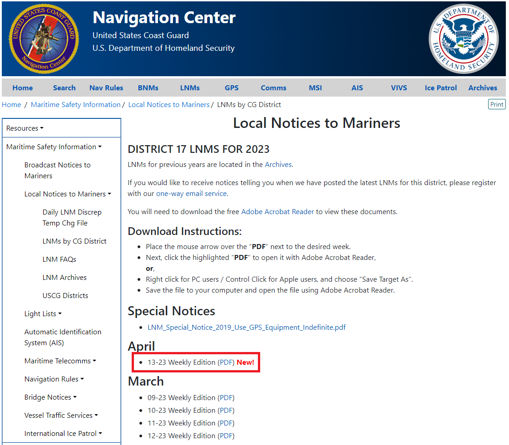
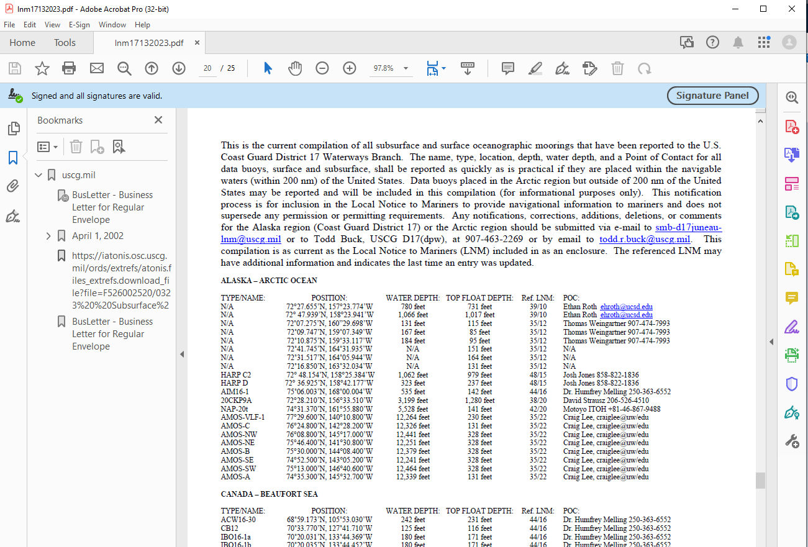
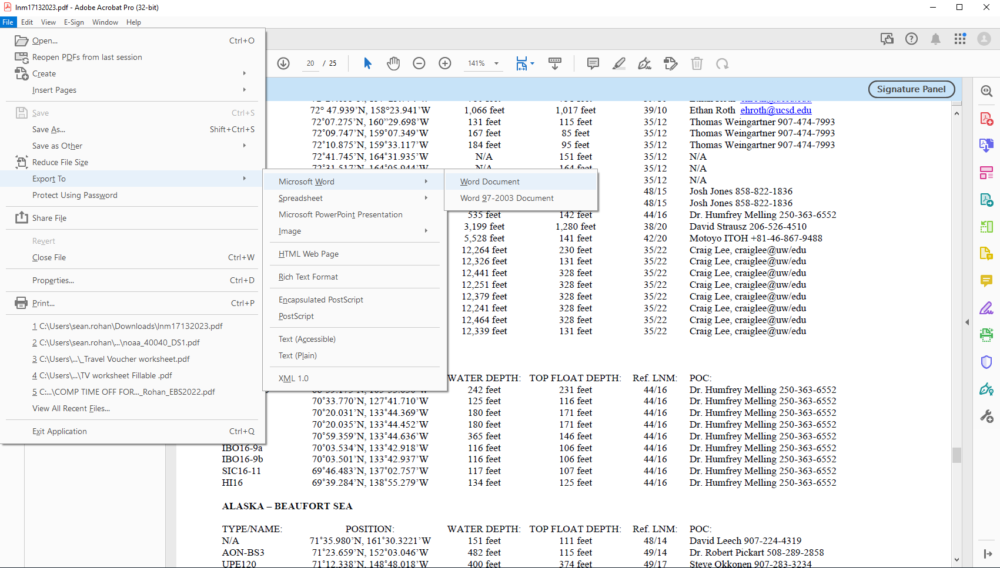
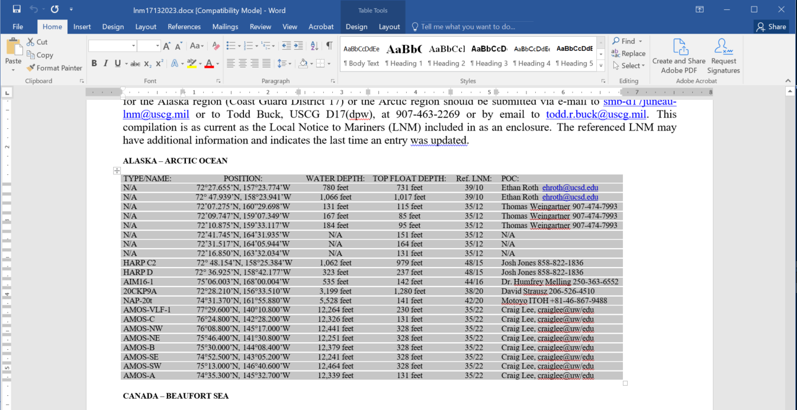
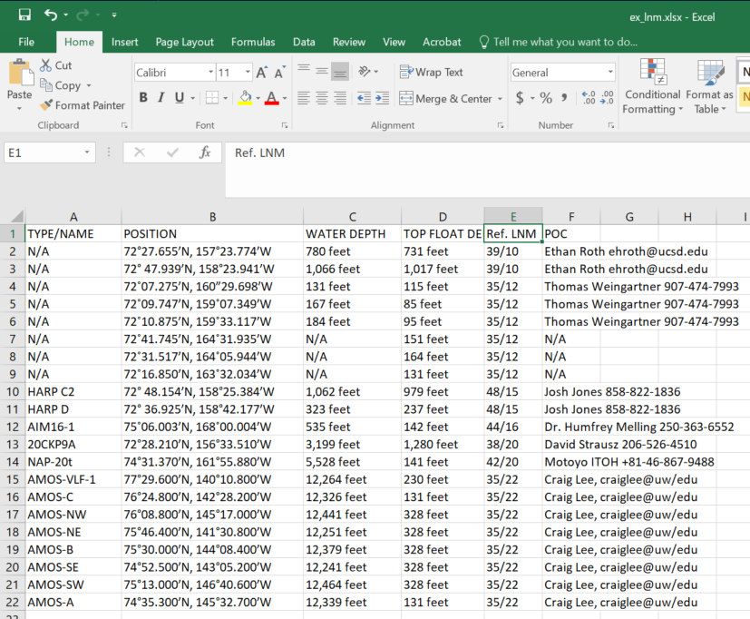

# Importing and converting mooring data for use in navmaps
**Updated on April 1, 2023**

The [United States Coast Guard Navigation Center](https://www.navcen.uscg.gov/) publishes weekly information about oceanographic mooring locations in Local Notices to Mariners (LNMs). In Alaska, LNMs are published by District 17 that are here available in tables in PDF files that are posted [here](https://www.navcen.uscg.gov/local-notices-to-mariners?district=17+0&subdistrict=n).


### 1. Download the PDF.



### 2. Open the PDF in Adobe Acrobat Reader. Check that the moorings tables are in the file:



### 3. Export the PDF to a .docx format that can be used to extract the tables (File -> Export To -> Microsoft Word -> Word Document)



### 4. Open the document in Microsoft Word and navigate to the moorings tables in the file.



### 5. Open a new workbook in Microsoft Excel.
### 6. Copy individual tables from the moorings table in the .docx file to the Excel workbook one at a time. Add a field for region information if necessary. Only copy the header column once. To ensure consistent formatting, it may help to change the 'Ref. LNM' field type from General to Text in Excel to ensure that Ref. LNM values don't get converted to dates.



### 7. Save the Excel file.
### 8. Open R/RStudio and load the navmaps package.
### 9. Read the Excel file into R using readxl::read_xlsx(). The POSITION field is formatted as a degree and decimal minute (DDM) string that will be read as a character vector. It will need to be converted to decimal degree (DD) latitude and longitude values for use in navmaps.
### 10. Use the dms_string_to_dd() function from the navmaps package to convert strings from DDM to DD to decimal degree format:

```
library(navmaps)

dat <- readxl::read_xlsx(path = system.file("/extdata/ex_lnm.xlsx", package = "navmaps"))

dat <- dplyr::mutate(dat,
                     LONGITUDE = dms_string_to_dd(POSITION)[,1],
                     LATITUDE = dms_string_to_dd(POSITION)[,2])
```

At this point, the moorings data can be converted to sf and passed to sf_to_nav_file() like any other spatial data in a data.frame.